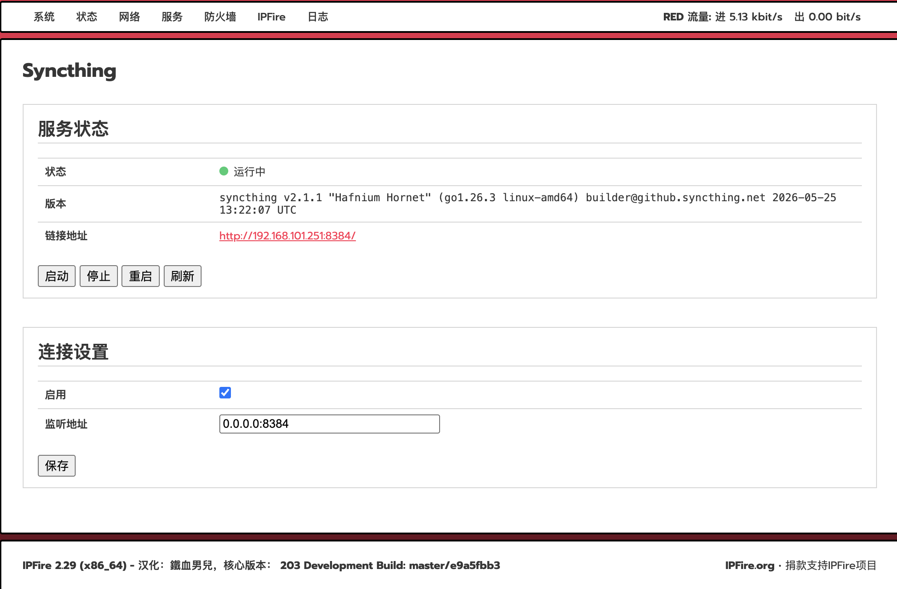

# Syncthing for IPFire


Syncthing 是一款免费开源的持续文件同步工具，无需依赖中央云服务器，即可在设备之间安全地直接同步文件。数据传输采用端到端加密技术，确保了隐私与安全。Syncthing 支持 Windows、macOS、Linux 及多种其他平台，是跨计算机和网络进行自托管点对点文件同步的理想解决方案。

本插件用于在 IPFire 上安装 Syncthing，提供一种简单便捷的方式在 IPFire 防火墙系统上部署和管理 Syncthing。

## 功能

- 快速安装与卸载
- 原生集成于 IPFire 系统
- 基于浏览器的 Syncthing 管理界面
- 已在 **IPFire 2.29 (x86_64) Core Update 203** 上测试通过

## 截图



## 安装

```sh
sh install.sh
```
安装完成，转到服务>syncthing进行操作

## 卸载

```sh
sh uninstall.sh
```

## 免责

这是一个非官方社区项目，与 IPFire 团队没有任何关联，也未获得其认可或支持。 部署前请自行审查源代码，并自行承担使用过程中可能产生的风险。
