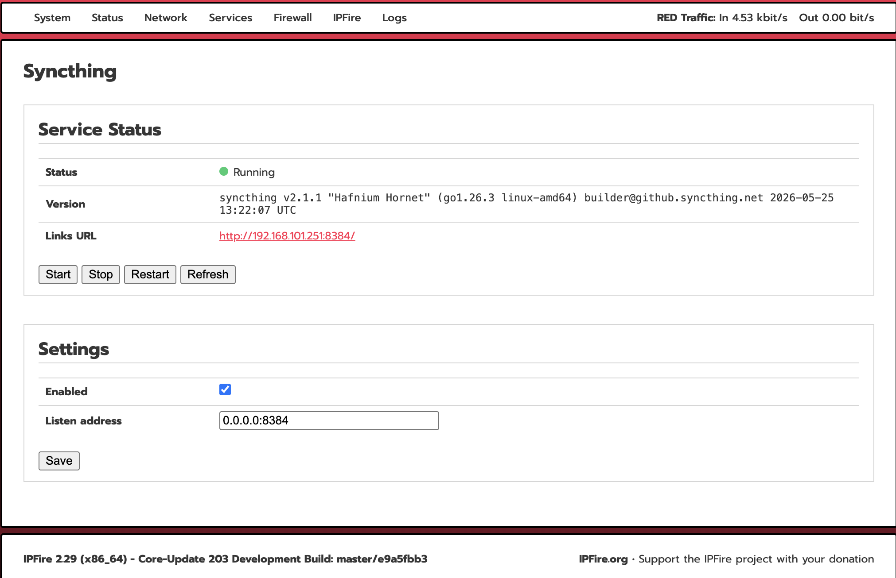

<div align="center">
  <a href="README.md">English</a> |
  <a href="README.CN.md">中文</a>
</div>

# Syncthing for IPFire


Syncthing is a free and open-source continuous file synchronization tool that securely syncs files directly between devices without relying on a central cloud server. Data is transferred using end-to-end encryption, ensuring privacy and security. Syncthing supports Windows, macOS, Linux, and many other platforms, making it an ideal solution for self-hosted, peer-to-peer file synchronization across computers and networks.

This plugin installs **Syncthing** on IPFire and provides an easy way to deploy and manage Syncthing on your firewall system.

## Features

- Quick installation and removal
- Native integration with IPFire
- Browser-based Syncthing management interface
- Tested on **IPFire 2.29 (x86_64) Core Update 203**

## Screenshot



## Installation

```sh
sh install.sh
```

Copy the project directory to your IPFire system and run the installer as **root**.

Installation complete; go to Services > Syncthing to proceed.

## Uninstallation

```sh
sh uninstall.sh
```

## Tested Environment

| Component | Version |
|-----------|---------|
| IPFire | 2.29 |
| Core Update | 203 |
| Architecture | x86_64 |

## Disclaimer

This is an unofficial community project with no affiliation to the IPFire team; use it at your own risk.

## Contributing

Bug reports, feature requests, and pull requests are welcome.
